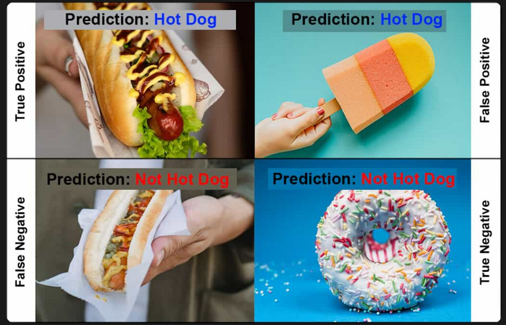

# CONFUSION MATRIX FOR AQUAVISION


## Confusion Matrix là gì?

Confusion Matrix là bảng giúp phân tích chi tiết các dự đoán của model.

Khác với mAP chỉ cho một con số tổng hợp, Confusion Matrix cho biết:

- Model dự đoán đúng bao nhiêu

- Model dự đoán sai bao nhiêu

- Model bỏ sót đối tượng nào

- Các Class nào dễ bị nhầm lẫn với nhau

Đây là một trong những công cụ quan trọng nhất để thực hiện Error Analysis sau khi train model.


## Các thành phần cơ bản



| Term | Ý nghĩa |
|-----------------------|-----------------------|
| TP (True Positive) | Dự đoán đúng đối tượng |
| FP (False Positive) | Báo có đối tượng nhưng thực tế không có |
| FN (False Negative) | Bỏ sót đối tượng |
| TN (True Negative ) | Dự đoán đúng là không có đối tượng |


## Ý nghĩa trong Object Detection

Đối với YOLO và Object Detection


- TP (True Positive)
```text
--> Model dự đoán đúng cá

Điều kiện:

+ Đúng class
+ IoU >- threshold

Ex:
Ground Truth = Fish

Prediction = Fish

IoU = 0.75
```

- FP (False Positive)
```text
--> Model phát hiện cá nhưng thực tế không có

Ví dụ:

Bọt khí

Bóng đổ

Ống nước

Phản xạ ánh sáng

--> bị nhận nhầm là cá

```

- FN (False Negative)
```text
--> Thực tế có cá nhưng model không nhận diện được

Ví dụ:

Cá quá nhỏ

Cá bị che

Cá nằm sát thành bể

Ánh sáng yếu
```

- TN (True Negative)
```text
Trong Object Detection thường ít được quan tâm

Lý do: phần lớn khung hình không chứa đối tượng

--> Metric cần tập trung vào: TP, FP, FN
```


## Điểm cần ghi nhớ

Trong các dự án Computer Vision thực tế, Confusion Matrix thường là công cụ được sử dụng nhiều nhất để quyết định:

- Có cần thu thập thêm dữ liệu không?

- Cần label thêm trường hợp nào?

- Model đang yếu ở điều kiện nào?

- Dataset có bị lệch phân phối hay không?

Nói ngắn gọn:

+ mAP cho biết model tốt đến đâu

+ Confusion Matrix cho biết tại sao model tốt hoặc chưa tốt
